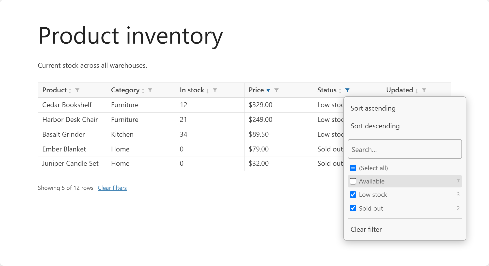
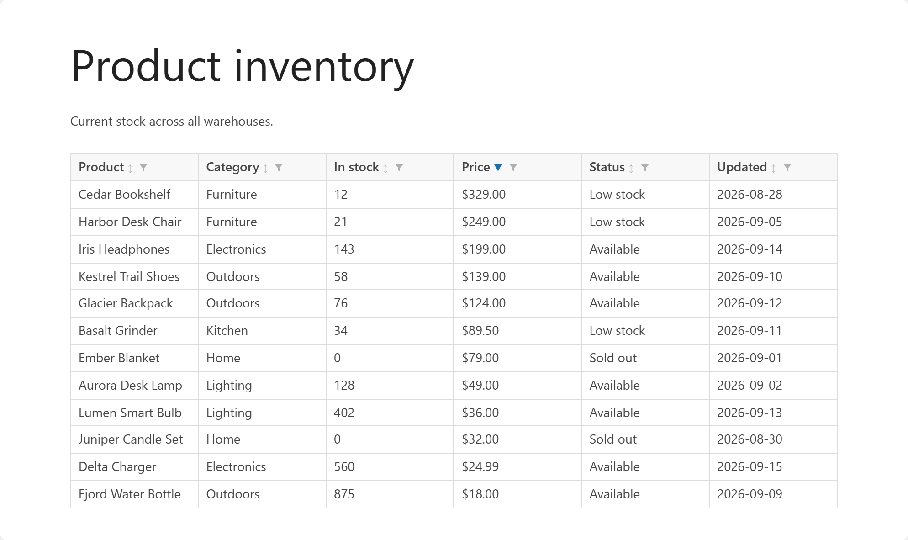
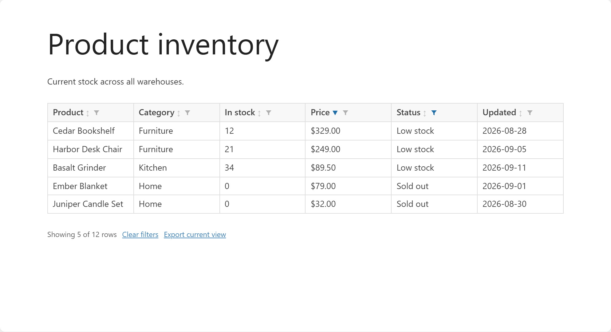
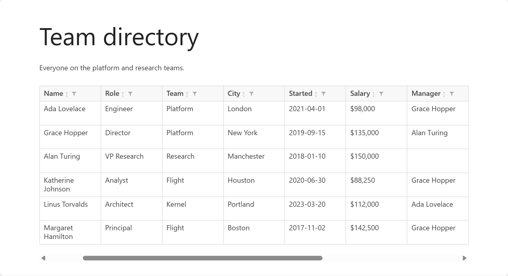
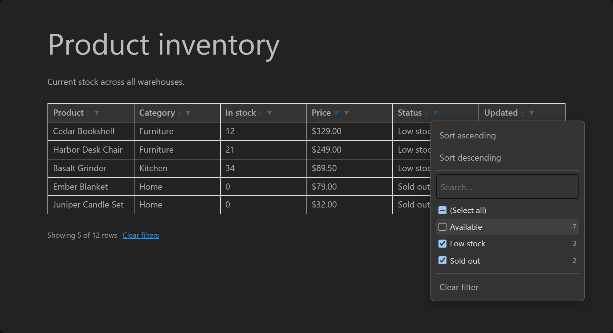
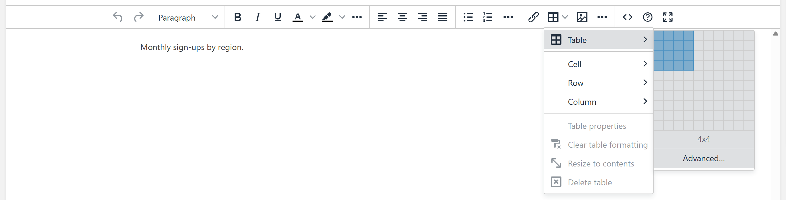
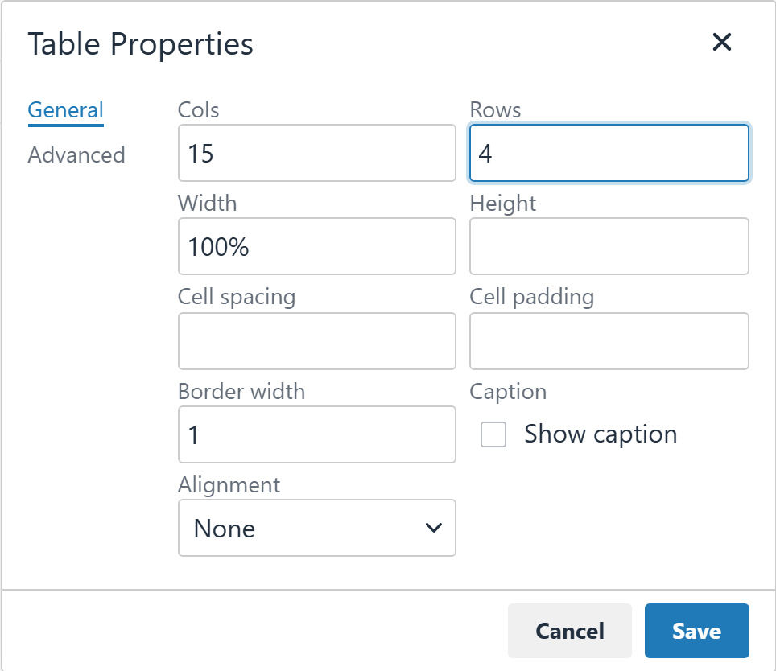
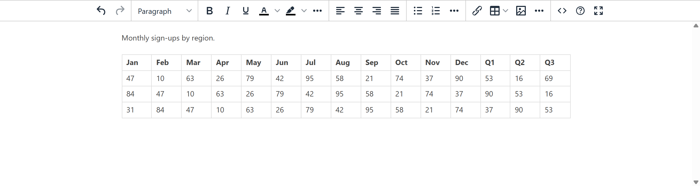
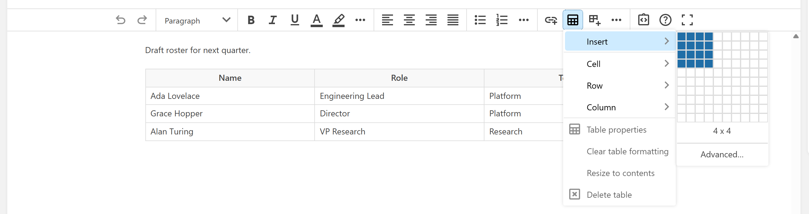

# BookStack Tables Extended

A script for [BookStack](https://www.bookstackapp.com) that adds sorting, filtering to tables and lets editors create tables with more than 10 columns.



> [!WARNING]
> Custom HTML head scripts like this one are not officially supported by BookStack. They depend on BookStack's internal page markup and styling, which is not a stable interface, so this script may break without notice in future BookStack releases.
>
> Only use this script with the BookStack versions listed under [Supported BookStack versions](#supported-bookstack-versions). Other versions have not been tested and are not supported by this project, and issues raised for unsupported versions will not be accepted.
>
> Never report problems with this script to the BookStack project. BookStack does not support it. If BookStack behaves unexpectedly, remove the script from Custom HTML Head Content and check again before contacting BookStack about anything.

## Features

### Viewing a page

- Sort any column. Select a heading to sort ascending, again for descending, and a third time for the original order.
- Filter any column from a spreadsheet-style menu with a search box and a checklist of the column's values. Filters in several columns combine.
- Export the filtered view as an Excel file with the Export current view link that appears under the table while a filter is active. The file is created in your browser.
- Scroll wide tables sideways instead of squeezing the columns.
- Numbers, currencies and percentages sort as numbers. Text sorts without regard to case, and empty cells sort last.
- Works automatically on the tables in your pages, in light and dark mode.
- Sorting and filtering only change what you see. The saved page is never modified, and they reset when the page reloads.

### Editing a page

- Create tables with more than 10 columns. Both editors keep their 10 by 10 grid and add an Advanced… button for any number of columns and rows, up to a limit you can configure. See [Editing tables](#editing-tables).
- Change the number of columns and rows of an existing table from Table properties.

## Screenshots

### Sort and filter

Select a heading to sort. The arrow shows the direction, and the funnel opens the filter menu.



The funnel is highlighted while a filter is active. A line under the table shows how many rows match, with links to clear all filters and to export the current view as an Excel file.



### Horizontal scroll

Tables with many columns scroll sideways inside the page instead of squeezing every column.



<details>
<summary>Dark mode</summary>

Colours follow your BookStack theme.



</details>

### Creating tables wider than 10 columns

In the WYSIWYG Editor, the Table menu keeps its 10 by 10 grid and gets an **Advanced…** button under the size.



**Advanced…** asks for the number of columns and rows.



The result is a table with as many columns as you asked for, up to the configured maximum.



<details>
<summary>New WYSIWYG (beta)</summary>

The new WYSIWYG has the same **Advanced…** button under its grid, and an extra toolbar button next to the table button.



</details>

## Supported BookStack versions

This script is tested against the exact BookStack releases below. **Use it only with these releases.** Any other release, including other patch releases of the same version line, is unsupported.

| BookStack release | Viewing pages from either editor | Larger tables in the WYSIWYG Editor | Larger tables in the new WYSIWYG (beta) |
| ----------------- | -------------------------------- | ----------------------------------- | --------------------------------------- |
| v23.05            | Supported                        | Supported                           | Not available in this release           |
| v23.12.3          | Supported                        | Supported                           | Not available in this release           |
| v24.02.3          | Supported                        | Supported                           | Not available in this release           |
| v26.09            | Supported                        | Supported                           | Supported                               |

Releases that are not listed are unsupported, including every other release between and after these, and every release older than v23.05.

When a new BookStack release comes out, keep running the version you have listed here until this table lists the new release.

## Editing tables

The script adds two things to BookStack's visual editors, the WYSIWYG Editor and the new WYSIWYG (beta). Viewing a page works the same whichever editor wrote it. You can choose the default editor under **Settings > Customization > Default Page Editor**.

### Create a table with any number of columns

1. Open the table menu. In the WYSIWYG Editor, choose **Table > Table**. In the new WYSIWYG, choose **Table > Insert**.
2. Pick a size on the grid for a small table, as usual. To go bigger, select **Advanced…** under the size and type the number of columns and rows.

The new WYSIWYG also has an **Insert table (custom size)** button in the toolbar, next to the table button, which opens the same dialog.

Tables created this way can have up to 50 columns and 200 rows. You can change these limits in [Configuration](#configuration).

### Change the size of an existing table

1. Click inside the table and open **Table properties**.
2. Change **Cols** and **Rows**, then select **Save**.

Columns and rows are added or removed at the end of the table. If making the table smaller would remove cells that contain content, you are asked to confirm first.

In the WYSIWYG Editor, one undo restores the previous size. In the new WYSIWYG, a large change takes a moment, and undo steps back one column or row at a time.

The features for the new WYSIWYG need BookStack v25.12 or later. See [Supported BookStack versions](#supported-bookstack-versions).

## Installation

1. Sign in to BookStack as an administrator.
2. Go to **Settings > Customization**.
3. In **Custom HTML Head Content**, add the script using one of these methods:
   - **Paste it.** Open `bookstack-tables-extended.js`, copy the whole file, and paste it between `<script>` and `</script>` tags.
   - **Serve it.** Copy `bookstack-tables-extended.js` into BookStack's `public` folder and add `<script src="/bookstack-tables-extended.js"></script>`.
4. Save the settings and reload a page that contains a table.

Custom HTML Head Content is not applied on the Settings pages, so check the result on a normal page.

## Configuration

To change a default, define `window.BookStackTablesExtended` in a `<script>` tag placed **before** the script:

```html
<script>
    window.BookStackTablesExtended = {
        minColumnWidth: 160,
        filter: false,
        editor: {
            maxColumns: 30,
        },
    };
</script>
<script src="/bookstack-tables-extended.js"></script>
```

| Option                | Default                         | Description                                                                                  |
| --------------------- | ------------------------------- | -------------------------------------------------------------------------------------------- |
| `sort`                | `true`                          | Turns column sorting on or off.                                                              |
| `filter`              | `true`                          | Turns the column filter buttons on or off.                                                   |
| `scroll`              | `true`                          | Turns horizontal scrolling on or off.                                                        |
| `minColumnWidth`      | `120`                           | Minimum column width in pixels before a table scrolls sideways.                              |
| `minRows`             | `2`                             | Tables with fewer body rows get horizontal scrolling only, without sorting or filtering.     |
| `maxListValues`       | `200`                           | A column with more distinct values than this shows the search box without the checklist.     |
| `export`              | `true`                          | Shows the Export current view link next to Clear filters while a filter is active.           |
| `skipSelector`        | `'.bte-skip, [data-bte="off"]'` | CSS selector for tables that are left completely alone.                                      |
| `editor.largeTables`  | `true`                          | Turns the larger table support in the editors on or off.                                     |
| `editor.maxColumns`   | `50`                            | Most columns that can be created in one step.                                                |
| `editor.maxRows`      | `200`                           | Most rows that can be created in one step.                                                   |
| `labels`              | English text                    | Text shown in the interface. See the list below.                                             |

Set `editor: {largeTables: false}` to leave both editors exactly as BookStack ships them.

The keys of `labels` are `filterColumn(name)`, `sortAscending`, `sortDescending`, `search`, `selectAll`, `blanks`, `noValues`, `clearFilter`, `clear`, `exportView`, `showing(shown, total)`, `noMatches`, `advanced`, `removeContent`, `yes`, `no`, `updating`, `insertTable`, `columns`, `rows`, `insert` and `cancel`. Any key you leave out keeps its English text. Example of translating part of the interface:

```html
<script>
    window.BookStackTablesExtended = {
        labels: {
            sortAscending: 'Aufsteigend sortieren',
            sortDescending: 'Absteigend sortieren',
            search: 'Suchen',
            clearFilter: 'Filter zurücksetzen',
            clear: 'Alle Filter zurücksetzen',
            showing: (shown, total) => `${shown} von ${total} Zeilen`,
            noMatches: 'Keine passenden Zeilen',
        },
    };
</script>
```

## Turning the script off for a page

Add a [tag](https://www.bookstackapp.com/docs/user/tags/) to the page with the name `tablesextended` and the value `off`. The script leaves every table on that page alone when the page is viewed. A tag named `tablesextendedoff` with no value has the same effect.

The tag does not affect the editing features. Use `editor.largeTables` to turn those off.

## Known limitations

- Tables with merged cells that span several rows (`rowspan`) get horizontal scrolling only. Sorting and filtering are switched off for them.
- In a cell that spans several columns (`colspan`), the cell belongs to the first column it covers for sorting and filtering.
- A table without a designated header row uses its first row as the header, so that row cannot be sorted or filtered as data.
- Tables inside other tables are left alone.
- Numbers written with a decimal comma (`1,5`) are not read as numbers.
- Dates sort as text. Write them as `YYYY-MM-DD` if a date column needs to sort chronologically.
- Sorting and filtering are not saved. They reset when the page is reloaded and are not part of BookStack's exports. Printing from the browser prints the table as it is currently sorted and filtered, without the filter buttons.
- The filter search matches text only. Operators such as `>5` are not interpreted.
- Export current view saves the rows that are visible, in the order shown, as a single Excel sheet named after the page. The link only appears while a filter is active. Plain numbers are saved as numbers. Values with a currency symbol or percent sign, leading zeros or trailing decimal zeros are saved as text, exactly as shown, and only the heading row is formatted (bold).
- Tables that are added to the page after it has loaded are not enhanced.
- Changing **Cols** or **Rows** in table properties always works from the end of the table. To remove a column or row in the middle, use the editor's own delete column and delete row actions.
- In a table with merged cells, the Cols and Rows fields follow the editor's own insert and delete column and row commands, which may adjust merged cells.
- In the new WYSIWYG, the size limit is enforced by the dialog. A table inserted some other way, for example by pasting, is not limited.

## Development

The `tests` folder holds the Docker setup, ready-made tables for testing by hand, and the automated tests. See [tests/README.md](tests/README.md).

### Testing with Docker

`tests/docker-compose.yml` starts a BookStack for trying the script, with the script already served from its web root. Pages, settings and users are kept in Docker volumes, so they survive restarts. Nothing in it is meant for production use.

Run the Docker commands in this section from the `tests` folder:

```sh
cd tests
docker compose up -d
```

1. Open <http://localhost:6875> and sign in with `admin@admin.com` and `password`. The first start takes a minute while the database is prepared.
2. Go to **Settings > Customization** and set **Custom HTML Head Content** to `<script src="/bookstack-tables-extended.js"></script>`.
3. Create a page with a table and view it. The file `tests/tables-test.md` contains ready-made Markdown tables to paste into a page.

The container reads `bookstack-tables-extended.js` directly from the repository root, so edits apply the next time a page loads (hard-refresh to bypass the browser cache).

To test a specific BookStack release, set `BOOKSTACK_VERSION` to an image tag from the [linuxserver/bookstack tag list](https://github.com/linuxserver/docker-bookstack/pkgs/container/bookstack):

```sh
BOOKSTACK_VERSION=version-v23.05 docker compose up -d
```

An older release can fail to start on data that a newer release created. Run `docker compose down -v` first when you go back to an older release.

To remove the containers but keep your data:

```sh
docker compose down
```

To remove the containers and all data:

```sh
docker compose down -v
```

### Automated tests

The `tests` folder contains browser tests that run the script against BookStack releases in Docker. See [tests/README.md](tests/README.md) for how to run them.

## Acknowledgements

This project started from these BookStack feature requests and the workarounds people shared in them:

- [Table auto-sort (#1518)](https://codeberg.org/bookstack/bookstack/issues/1518)
- [Filter and sorting on columns within a table (#5743)](https://codeberg.org/bookstack/bookstack/issues/5743)
